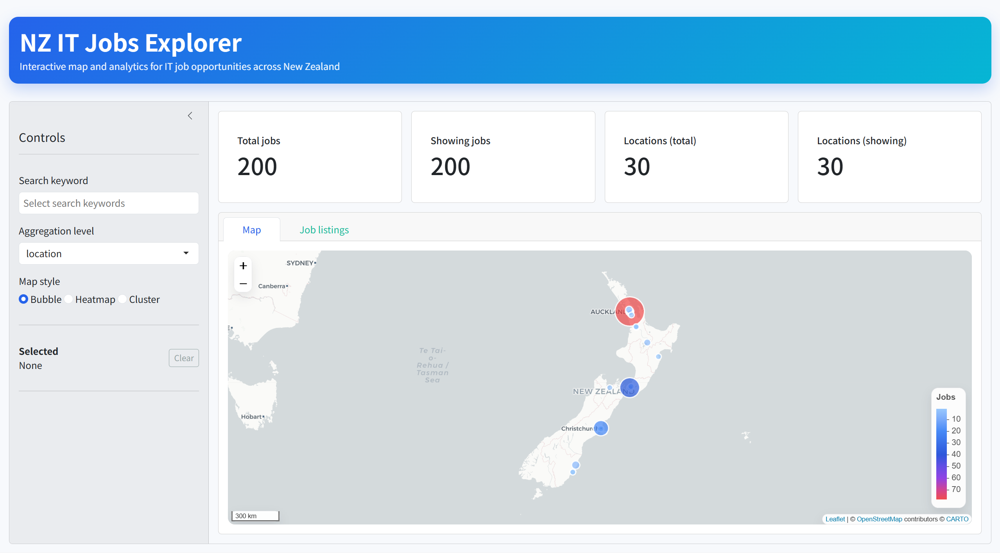
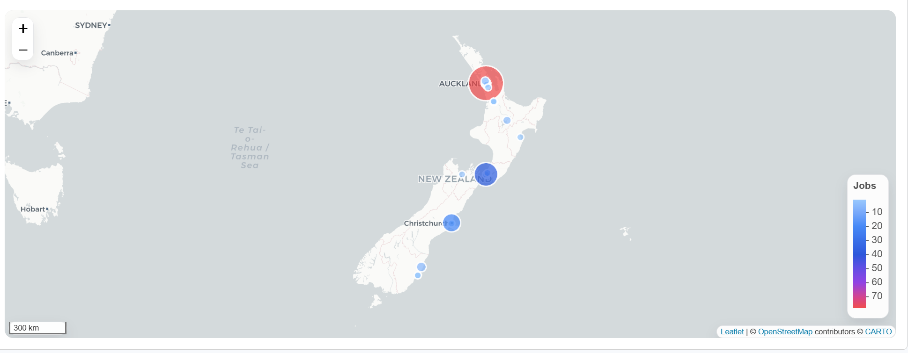
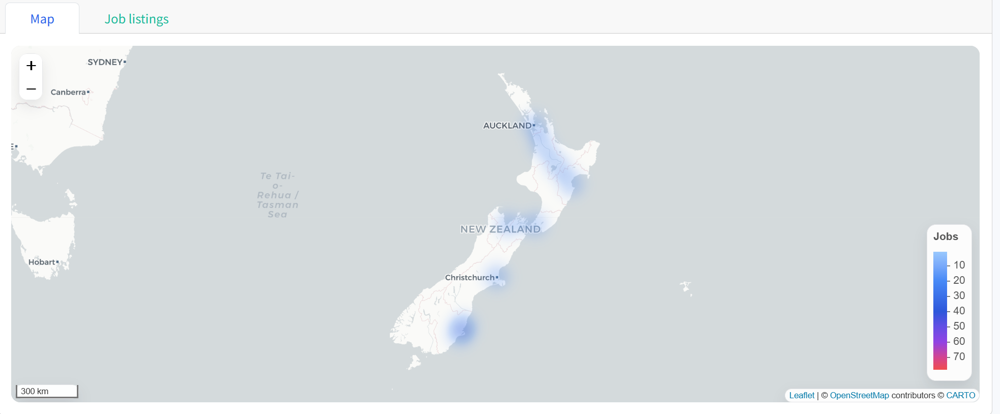
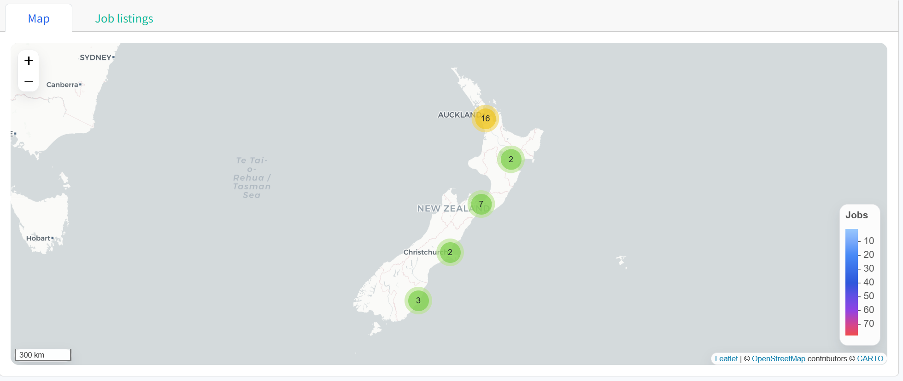
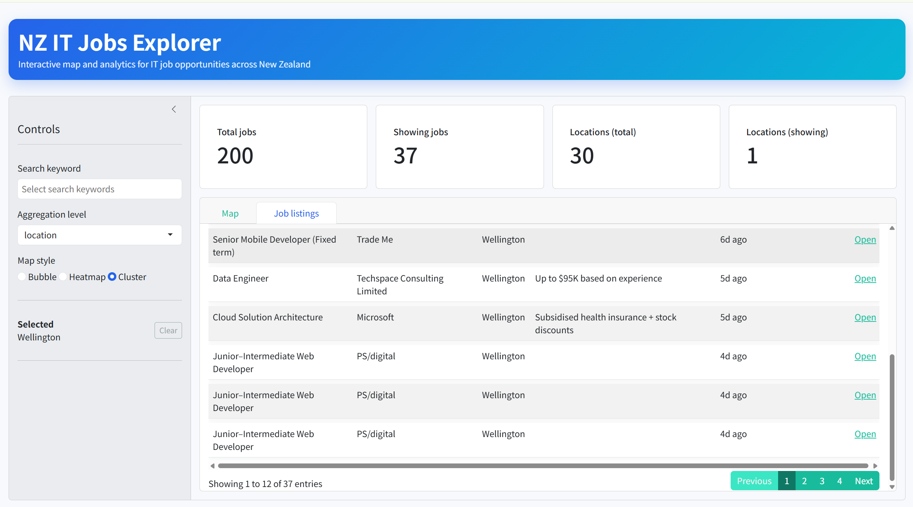

# NZ IT Jobs Explorer

An interactive web application for exploring and analyzing IT job postings across New Zealand. Built with R Shiny for the frontend and Python for data processing and geocoding.

## Features

- **Interactive Map Visualization**
  - Three visualization modes: Bubble markers, Heatmap, and Cluster view
  - Geographic distribution of job postings across New Zealand
  - Click on map or markers to filter job listings by location

- **Advanced Filtering & Aggregation**
  - Filter by search keywords
  - Aggregate by location or city level
  - Real-time KPI metrics (total jobs, showing jobs, location counts)

- **Job Listings Table**
  - Sortable and searchable data table
  - Detailed job information (title, company, location, salary, work type)
  - Direct links to job postings

- **Modern UI**
  - Clean, responsive design with Bootstrap 5
  - Custom styling with gradient headers and rounded components
  - Sidebar controls for easy navigation

## Screenshots

### Main Dashboard

*Overview of the application showing the interactive map and KPI cards*

### Map Views

*Bubble markers showing job density by location*


*Heatmap visualization of job distribution*


*Clustered markers for better performance with many locations*

### Job Listings

*Detailed job listings table with filtering and sorting capabilities*

> **Note:** To add screenshots, place your images in the `screenshots/` directory and update the paths above.

## Project Structure

```
R_Python_Data_Visualization_Web/
├── app.R                          # Main Shiny application entry point
├── R/
│   ├── app_ui.R                   # Application-level UI (theme, header, layout)
│   ├── app_server.R               # Application server
│   ├── modules/
│   │   ├── mod_jobs_explorer.R    # Main module (sources other module files)
│   │   ├── mod_jobs_explorer_ui.R # Module UI components
│   │   ├── mod_jobs_explorer_map.R # Map helper functions
│   │   └── mod_jobs_explorer_logic.R # Business logic and server functions
│   ├── services/
│   │   ├── jobs_data.R            # Data loading and preparation
│   │   └── jobs_service.R         # Data filtering and aggregation functions
│   └── utils/
│       └── location_utils.R       # Location normalization and geocoding utilities
├── add_coordinates.py             # Python script for geocoding job locations
├── scrape_nz_jobs.py              # Python script for scraping job data
├── normalize_csv_cities.py        # City name normalization utility
├── requirements.txt               # Python dependencies
├── install_packages.R             # R package installation script
└── README.md                      # This file
```

## Prerequisites

- **Python 3.9+**
- **R 4.1+**
- Internet access for geocoding (OpenStreetMap/Nominatim)

## Installation & Setup

### 1. Python Setup

Create and activate a virtual environment, then install dependencies:

**Windows (PowerShell):**
```powershell
python -m venv venv
.\venv\Scripts\Activate.ps1
pip install -r requirements.txt
```

**Linux/Mac:**
```bash
python -m venv venv
source venv/bin/activate
pip install -r requirements.txt
```

Or use the provided setup scripts:
- Windows: `.\setup_venv.ps1`
- Linux/Mac: `./setup_venv.sh`

### 2. Add Coordinates to the CSV

Run the geocoding script to generate a new CSV with latitude/longitude:

```powershell
python add_coordinates.py --input nz_jobs_data.csv --output nz_jobs_data_with_coords.csv
```

The script writes a local cache file (`geocode_cache.json`) to reduce API calls on subsequent runs.

### 3. R Package Installation

Install required R packages:

```r
source("install_packages.R")
```

Required packages:
- `shiny` - Web application framework
- `bslib` - Bootstrap themes and components
- `leaflet` - Interactive maps
- `leaflet.extras` - Additional map features (heatmap)
- `dplyr` - Data manipulation
- `readr` - CSV reading
- `DT` - Data tables

### 4. Run the Shiny App

```r
shiny::runApp("app.R")
```

The app will automatically load `nz_jobs_data_with_coords.csv` if available, otherwise it falls back to `nz_jobs_data.csv`.

## Usage

1. **Filter by Keywords**: Use the sidebar to select one or more search keywords to filter job postings
2. **Change Aggregation Level**: Switch between "location" and "city" to view data at different geographic granularities
3. **Switch Map Styles**: Choose between Bubble, Heatmap, or Cluster views
4. **Select Locations**: Click on the map or markers to filter the job listings table by location
5. **Explore Job Listings**: Use the "Job listings" tab to view, search, and sort detailed job information

## Technical Details

### Architecture

The application follows a modular architecture:

- **UI Layer** (`app_ui.R`): Application-level styling, theme, and layout
- **Module System**: Self-contained Shiny modules for feature isolation
  - `mod_jobs_explorer_ui.R`: Pure UI components (no reactive logic)
  - `mod_jobs_explorer_map.R`: Map-related helper functions
  - `mod_jobs_explorer_logic.R`: Business logic, reactive data flows, and server functions
- **Service Layer**: Data loading, filtering, and aggregation functions
- **Utils**: Reusable utility functions (location normalization, geocoding)

### Data Flow

1. Raw data is loaded and normalized (`jobs_data.R`)
2. Data is filtered by keywords (`jobs_service.R`)
3. Data is aggregated by location or city (`jobs_service.R`)
4. Aggregated data is visualized on the map (`mod_jobs_explorer_map.R`)
5. Selected location filters the job listings table

## Notes

- If some locations fail to geocode, review or extend the manual mapping in `add_coordinates.py` (`MANUAL_LOCATION_MAP`)
- Geocoding uses OpenStreetMap Nominatim. Be considerate with request rates
- The application supports three map visualization modes for different use cases:
  - **Bubble**: Individual markers sized by job count
  - **Heatmap**: Density-based visualization
  - **Cluster**: Grouped markers for performance with many locations

